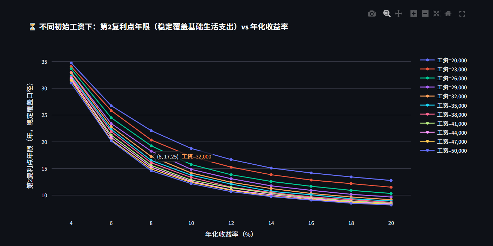

头脑风暴了必须四年才能交易
至少两万月薪才能产能没有危机
副业的主要用途在35岁之后主要凸显嗯需要的金额为呃4200到6600，只要保证大概这种程度的副业那么，就跟两个人都是公务员差不多
利率甜蜜点在12%工资甜蜜点在32000
第一福利点只跟收益率有关

在第十年复利的收益十分之小而工资提升的收益十分之大
说一下三个复利点的定义。第一个复利点是。你的月利息等于你的定投金额。第二个复利点是你的月利息等于你的基本生活开支。第三个复利点是你的月利息等于你的工资。
按照蒙特卡洛计算第二复利点。在5%的收益率跟。两万八的初始月工资情况下，应该要十年以上才能到达。

通过投保医疗保险失业保险等等保险以及重大疾病保险还有年度定期体检可以大概率的减少意外事件黑天鹅事件的冲击包括概率还有金额
