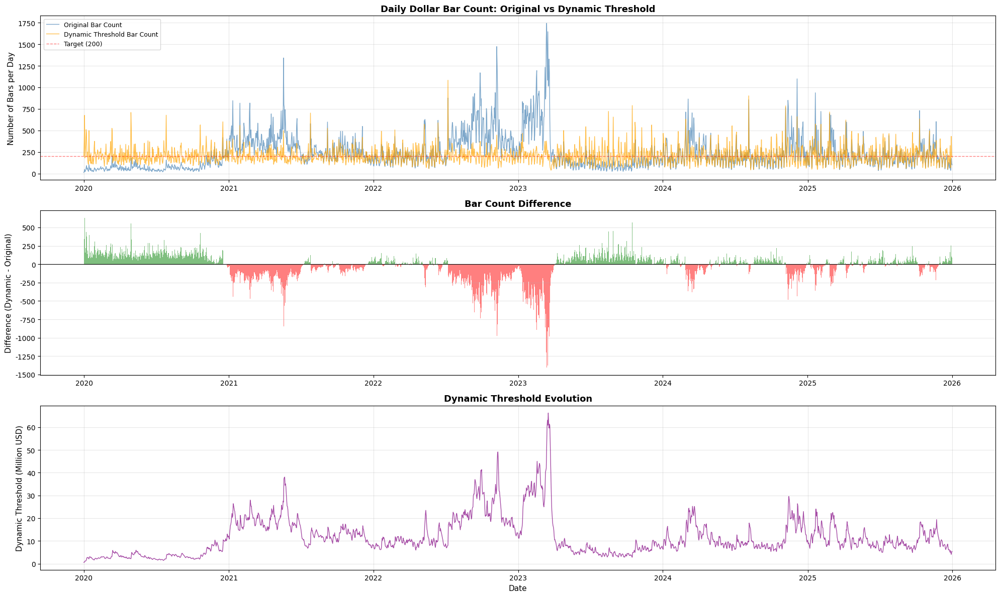
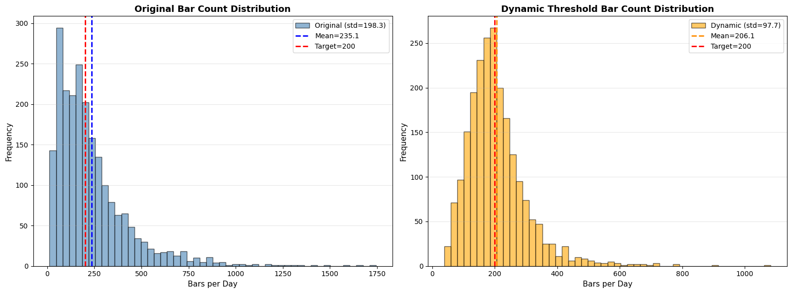
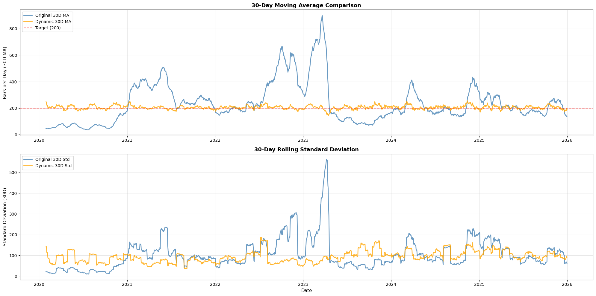

# 数据处理
## 1 Concept
### 1.1 平稳性
#### 1.1.1 什么是平稳性
1. **严平稳 (Strict Stationarity):**
要求极其严格。指时间序列中任意一组随机变量的联合概率分布，在时间平移后保持不变。
即：$(X_{t_1}, ..., X_{t_k})$ 的分布与 $(X_{t_1+\tau}, ..., X_{t_k+\tau})$ 完全相同。
在实际应用中很难满足，也很难检验。
2. **宽平稳 / 弱平稳 (Weak / Wide-sense Stationarity):**
一个时间序列 $\{X_t\}$ 被称为弱平稳，必须同时满足以下三个条件：
a. **均值是常数：** $E[X_t] = \mu$ （不随时间 $t$ 变化，即没有趋势）。
b. **方差是常数：** $Var(X_t) = \sigma^2$ （波动率稳定，不随时间 $t$ 变化）。
c. **自协方差只与时间间隔有关：** $Cov(X_t, X_{t+k}) = \gamma_k$ （现在的 $X_t$ 和未来的 $X_{t+k}$ 之间的关系，只取决于它们隔了多久，而不是取决于现在是哪一年）。
3. **形象的例子:**
想象一个球在地面上滚动：
平稳： 地面是平的。球滚动的速度和颠簸程度（方差）大致保持一致，你可以根据过去几秒的运动很好地预测下一秒。
不平稳： 地面是起伏的山坡。球可能正在加速下坡（均值变化），或者进入了乱石滩（方差变大），过去的规律无法直接套用到未来。

#### 1.1.2 平稳性的作用
1. **保证“历史可以被借鉴” (Predictability)**
a. **平稳性的本质是**：数据的统计特性（均值、方差）在时间上是恒定的。
b. **作用：** 神经网络在训练时，是在寻找 $X$ 到 $Y$ 的映射函数。如果 $X$ 是平稳的，这个函数在未来依然有效。如果是非平稳的（比如均值一直在涨），模型就会遇到它从未见过的数值，导致输出完全随机（外推失败）。那么很有可能在2024年成立的策略在，在2025年完全失效。
2. **消除“伪回归” (Avoiding Spurious Regression)**
这是非平稳数据最危险的陷阱。
a. **现象：** 两个完全无关的非平稳变量（比如“BTC的价格”和“我头发掉落的数量”），由于它们都在随时间增长，统计软件会告诉你它们的相关性高达 99%。
b. **用处：** 确保平稳性可以过滤掉这种由于“时间趋势”产生的假象。如果你在非平稳的价格上直接做回归，你得到的信号可能只是某种随机趋势的巧合，一进实盘就失效。
3. **让深度学习的梯度更稳定 (Gradient Stability)**
**用处：** 神经网络（如 LSTM/Transformer）对输入数据的量级非常敏感。模型更容易收敛。非平稳数据会导致损失函数（Loss Function）出现剧烈震荡。比如价格突然暴涨，输入的数值瞬间翻倍，这会产生巨大的梯度冲击，直接把模型原本学好的权重“带偏”甚至搞崩（梯度爆炸）。

#### 1.1.3 ADF检验（判断是否满足平稳性）
1. **假设**
原假设 (H0)： 数据不平稳（存在单位根）。
备择假设 (H1)： 数据是平稳的。
2. **看P-value (P值)**
如果 P-value < 0.05 (5%)：拒绝原假设。结论：数据是平稳的。
如果 P-value > 0.05：不能拒绝原假设。结论：数据是不平稳的。

#### 1.1.4 画图，直观理解
1. **时序图**，看看波动率与趋势，平稳的数据应该像心电图一样，围绕一个水平中心线上下震荡，且震荡幅度大致相同.
2. **自相关图 (ACF Plot)**
平稳数据： ACF 曲线会迅速衰减到 0 附近（即与滞后的自己没有相关性）。
不平稳数据： ACF 曲线衰减非常缓慢，甚至一直保持在较高的正值（说明今天的价格深受很久以前价格的影响）。

### 1.2 分布漂移
#### 1.2.1 什么是分布漂移
**分布漂移**（也称 Dataset Shift）通常出现在**监督学习**（Supervised Learning）的背景下。它指的是训练数据（Source Domain）和测试/实际应用数据（Target Domain）的概率分布不一致的现象。

数学表达：设 $X$ 为特征，$Y$ 为标签。训练集分布 $P_{train}(X, Y)$ 不等于测试集分布 $P_{test}(X, Y)$。
根据贝叶斯公式 $P(X, Y) = P(Y|X)P(X) = P(X|Y)P(Y)$，分布漂移可以细分为以下几类：
1. **协变量漂移 (Covariate Shift):**
a. **定义：** 输入特征的分布 $P(X)$ 变了，但映射关系 $P(Y|X)$ 没变。
b. **例子：** 训练一个人脸识别模型，训练集全是年轻人（$P(X)$ 偏向年轻），测试集全是老年人。虽然“人脸->身份”的映射逻辑没变，但模型可能因为没见过老年人特征而失效。
2. **标签漂移 (Label Shift / Prior Shift):**
a. **定义：** 标签的先验分布 $P(Y)$ 变了，但 $P(X|Y)$ 没变。
b. **例子：** 预测流感。平时流感比例只有 5%，流感爆发季变成了 40%。疾病的症状表现没变，但患病概率变了。
3. **概念漂移 (Concept Drift):**
a. **定义：** 最棘手的一种。输入与标签的关系 $P(Y|X)$ 变了。
b. **例子：** 垃圾邮件分类。过去“打折”可能是正常邮件，现在黑客学会了用“打折”来伪装钓鱼邮件。词汇（$X$）没变，但含义（$Y$）变了。

#### 1.2.2 如何避免/检测分布漂移
量化中对抗分布漂移一般都是采用return，因为价格是分布漂移的，但是return其实就是一阶差分，没有保存过去的信息，所以需要使用**分数阶差分 (Fractional Differentiation)**，或者其他什么方法。
1. **静态特征动态化 (Stationarity Transformation)**
不要直接输入原数值。
错误做法： 输入 Duration (秒数)。
正确做法： 输入 log(Duration / Moving_Average_Duration)。这样无论市场多快，你输入的是“相对快慢”，其分布始终保持在 0 附近，极大地消除了协变量偏移。
2. **对抗性验证 (Adversarial Validation)**
拿你的训练集和回测集。
训练一个分类器（比如随机森林）去猜“这行数据是属于训练集还是回测集”。
如果分类器的 AUC 很高（比如 >0.7），说明你的数据分布已经发生了严重漂移，此时模型预测大概率会失效。
#### 1.2.3 与平稳性的区别与关系
金融时间序列数据，非平稳性是造成分布漂移的根本原因（概念漂移）
1. **场景：** 假设你训练了一个简单的机器学习模型来预测比特币的涨跌：
a. **输入特征 ($X$)**：过去 1 小时的价格**波动幅度**（最高价 - 最低价）。
b. **输出标签 ($Y$)**：下一小时是涨 (1) 还是跌 (0)。
c. **模型学到的规律（概念 $P(Y|X)$）**：模型在训练数据中发现，只要波动幅度超过 **50 美元**，接下来大概率会惯性上涨。
逻辑： `波动 > 50 -> 买入`
2. **非平稳性发生了（统计学视角）**
现在，时间推移，市场环境变了。
a. **以前（训练期）：** 比特币价格是 3,000 美元。一天波动 100 美元算剧烈波动。方差较小
b. **现在（测试期）：** 比特币价格涨到了 60,000 美元。一天随便波动都是 2,000 美元。方差很大
**这就是非平稳性**。数据的统计特性（方差/波动率）随时间发生了巨大的改变。
3. **概念漂移随之出现（机器学习视角）**
现在，你的模型还在用旧的逻辑跑在流式数据上：
a. **流式数据进来**：当前波动幅度是 **60 美元**。
b. **模型判断**：60 > 50，触发“剧烈波动”阈值，**预测：买入**
4. **结论**
a. **机器学习的目标**是学习条件概率 $P(Y|X)$。
b. **流式数据的现实**是联合分布 $P(X, Y)$ 随时间 $t$ 变化（非平稳）。
c. **根据贝叶斯公式：**$P(Y|X) = \frac{P(X, Y)}{P(X)}$。
$P(X)$ 整体右移了，$P(X, Y)$ 也变了，但最关键的是 $P(Y|X)$ 变了。因为数据的**方差非平稳**（波动率放大这一物理事实），导致了“波动幅度”这个特征与“涨跌”这个标签之间的**映射关系（概念）失效了**。

### 1.3 正态分布
#### 1.3.1 机器学习一定要“正态分布”吗？
不同模型不一样：
1. **线性模型（如线性回归、逻辑回归）：** 它们并不严格要求特征 $X$ 是正态分布，但通常假设残差（误差项）服从正态分布。如果数据极度偏态，模型的预测效率和统计推断的准确性会打折扣。
2. **概率模型（如朴素贝叶斯、LDA）：** 某些变体（如高斯朴素贝叶斯）会显式假设特征满足正态分布。如果实际分布差太远，效果会很差。
3. **树模型（如随机森林、XGBoost、LightGBM）：** 它们是“由于不吃正态分布这一套”而闻名的。树模型通过寻找切分点来工作，对数据的单调变换不敏感。无论你的数据是正态的、偏态的还是奇形怪状的，树模型通常都能处理得很好。
4. **深度学习：** 神经网络不假设正态分布，但它们非常喜欢“归一化”后的数据（即均值为 0，方差为 1）。这让梯度下降跑得更快。
因此，正态分布只是工程上的优化。

### 1.3 dollar bar
#### 1.3.1 dollar bar的优势
**优化采样：** 增加采样频率，在市场比较火热的时候，记录下更多的数据，在市场比较平淡的时候，记录下比较少数的数据
#### 1.3.2 如何在dollar bar中加入宏观因子
1. **开始时间：** 使用 Bar 开始时的宏观值给每个 Dollar Bar 赋予其开始时间那一刻最新的宏观数据。避免未来函数，但是如果发生巨变会无法捕捉到。
优点： 绝对没有未来函数，模型非常稳健。
1. **加权平均：** 对指标按照时间使用加权平均。

#### 1.3.3 如何设置dollar bar的threshold
1. **为什么需要设置阈值**
因为每一个bar都有时间戳的概念（时长），因此，在模型训练中，过去牛市中形成一个bar的时长假设是2min，平静时期形成一个bar要10min，但是因为btc的市场越来越火热，所以现在市场平静期形成一个bar是2min，市场火热期形成一个bar是20s，那么假设模型在过去中牛市学习到了什么，那么他看到当前市场，会认为这个市场一致都是牛市，那么模型的输出就会变形。
其实这就是一种分布漂移。

2. **如何设置阈值**
a. **基于目标采样频率的“每日校准”**
让每天产生的 Bar 数量维持在一个合理的范围内（比如每天 500-1000 个）。
逻辑： 每天收盘（UTC 0点）后，计算过去 $N$ 天（如 14 天）的日均成交额。
公式：$$Threshold_{today} = \frac{Average\_Daily\_Volume_{last\_14d}}{Target\_Bars\_Per\_Day}$$
b. **基于 EMA（指数移动平均）的平滑调整**
计算当前成交额的 $EMA_{volume}$（取一个较长的时间窗口，比如 30 天）。设置一个“比例常数” $k$。$Threshold = EMA_{volume} \times k$。
c. **分层阈值法（Regime-Based）**
将市场分为“极度活跃”、“正常”、“清淡”三个状态。
如果过去 24h 成交额 > 均值 + 1.5 倍标准差：使用高阈值（防止样本爆炸）。
如果过去 24h 成交额 < 均值 - 1.5 倍标准差：使用低阈值（防止没有样本）。
其余时间：使用基准阈值。
优势： 这种方法在策略逻辑上最容易回测，因为阈值的变动是阶跃式的，你可以清晰地知道模型在不同 Regime 下的表现。


### 1.4 异方差性
随机变量的“波动幅度”不是恒定的，而是随着时间或另一个变量的变化而变化的。

## 2. TODO
### 2.1 整个流程
#### 2.1.1 Download Raw Data
获取原始data

#### 2.1.2 Generate Bar 
采样，对trade使用动态阈值，生成dollar bar
1. **使用动态阈值**
```
原始Bar数量统计:
  平均: 235.1 bars/day
  中位数: 182.0 bars/day
  标准差: 198.3
  变异系数: 84.34%
  范围: [12, 1744]

动态阈值Bar数量统计:
  平均: 206.1 bars/day
  中位数: 190.7 bars/day
  标准差: 97.7
  变异系数: 47.43%
  范围: [38.3, 1083.0]
```



1. **输入因子，区分市场结构**
计算生成这根 Dollar Bar 花了多少秒 ($\Delta t$)。
输入特征加入：$\log(\Delta t)$。
当 $\Delta t$ 很小时，这是高频模式；$\Delta t$ 很大时，这是低频模式

3. 什么样的数据需要平稳性
a. label需要平稳
b. 输入序列的物理意义需要平稳

一个很显然的问题是：
其实将bar number尽量控制平稳之后，会发现threshold其实就变得不平稳了，这其实就是一种非平稳性的转移。
但其实这是无所谓的，因为bar生成的频率不同其实物理意义上影响更大，在没有处理之前，一天最少会生成十几个bar，说明平均一个多小时生成一个bar，最多一天会生成1700+个bar，平均下来50s生成一个，那么每个bar代表的物理意义差别就很大了。
模型能否即学习到高频策略同时学习到低频策略呢？
其实不仅如此，其实策略的频率变化就实在太大了，从秒级的策略到日内低频策略，这变化范围实在太大了，有可能学好吗？
不过如果只是threshold不平稳，其实关系不是很大，因为这只是模型输入的一个特征而已


还需要做进一步的分析，比如我的策略频率希望是5-10分钟，那么一天生成的bar数量我希望是在144-288之间，我应该设置一个上下限，然后看看在这个区间内有多少天，在这个区间外有多少天，算算比例


#### 2.1.3 ADF检验，生成新序列
使用分数阶差分处理dollar bar的close price or others，使其平稳化, 使用ADF检验，同时在这个步骤搞一些其他因子

#### 2.1.4 Event Filter 
使用CUSUM决定对哪些bar打标签

#### 2.1.5 Labeling 
在 CUSUM 触发点，用 动态波动率调整的 Triple Barrier 生成标签

#### 2.1.6 Weighting
去重，计算样本重叠度，生成 Sample Weights。

#### 2.1.7 计算常用指标/因子/增加数据

#### 2.1.8 Training
Purged K-Fold 验证你的因子是否对标签有预测能力。

